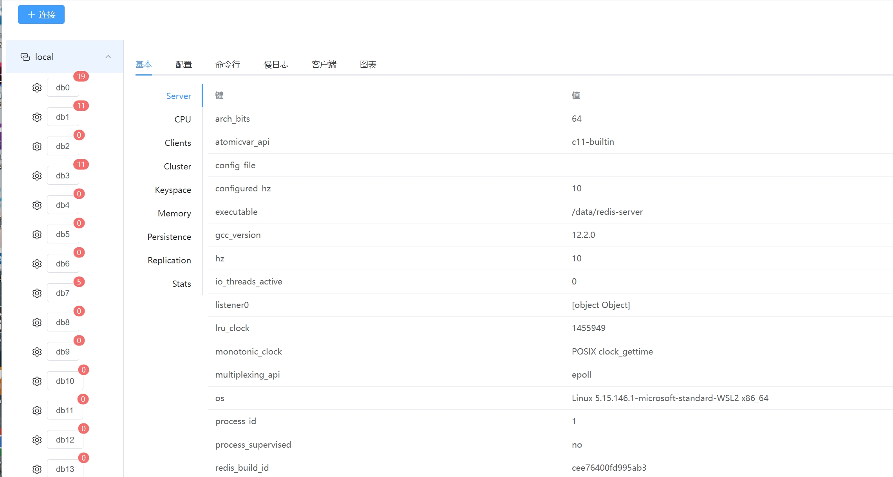
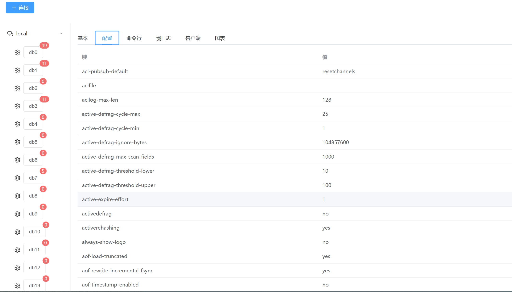

# rdm-toy

[](https://goreportcard.com/report/github.com/hexiaopi/rdm-toy)
[](https://opensource.org/licenses/MIT)
[](https://github.com/Hexiaopi/rdm-toy)

redis view manage tool

<p align="center">
English | <a href="README_CN.md">简体中文</a>
</p>

## Features

- redis manage
- db manage
- key manage
- support terminal

## 🛠 Skills

### frontend 

- vue3
- vite
- pina
- element-plus

### backend

- go
- redis
- gin

## Installation

### frontend

```bash
  cd web
  npm install
```

### backend

```bash
  go mod tidy
```
    
## Run Locally

### frontend

```bash
  cd web
  npm run dev
```

### backend

```bash
  go run cmd/root.go
```


## Screenshots






## Star History

[](https://star-history.com/#hexiaopi/rdm-toy&Date)

## License

[MIT](https://choosealicense.com/licenses/mit/)

