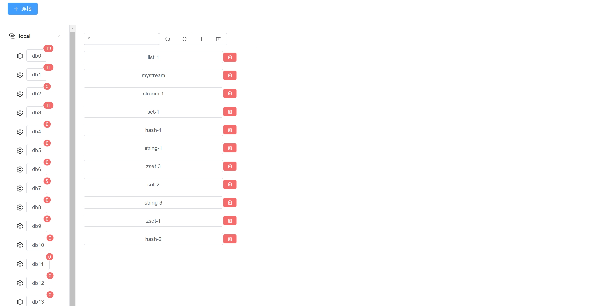

# rdm-toy

redis view manage tool

## Features

- redis manage
- db manage
- key manage
- support terminal

## 🛠 Skills

### frontend 

- vue3
- vite
- pina
- element-plus

### backend

- go
- redis
- gin

## Installation

### frontend

```bash
  cd frontend
  npm install
```

### backend

```bash
  cd backend
  go mod tidy
```
    
## Run Locally

### frontend

```bash
  cd frontend
  npm run dev
```

### backend

```bash
  cd backend
  go run cmd/root.go
```


## Screenshots





## License

[MIT](https://choosealicense.com/licenses/mit/)

