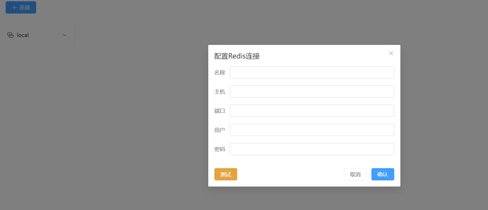
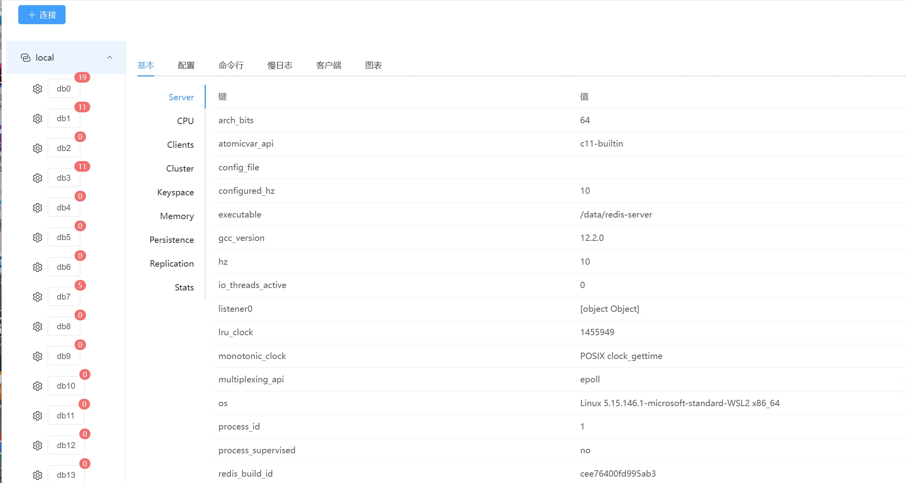
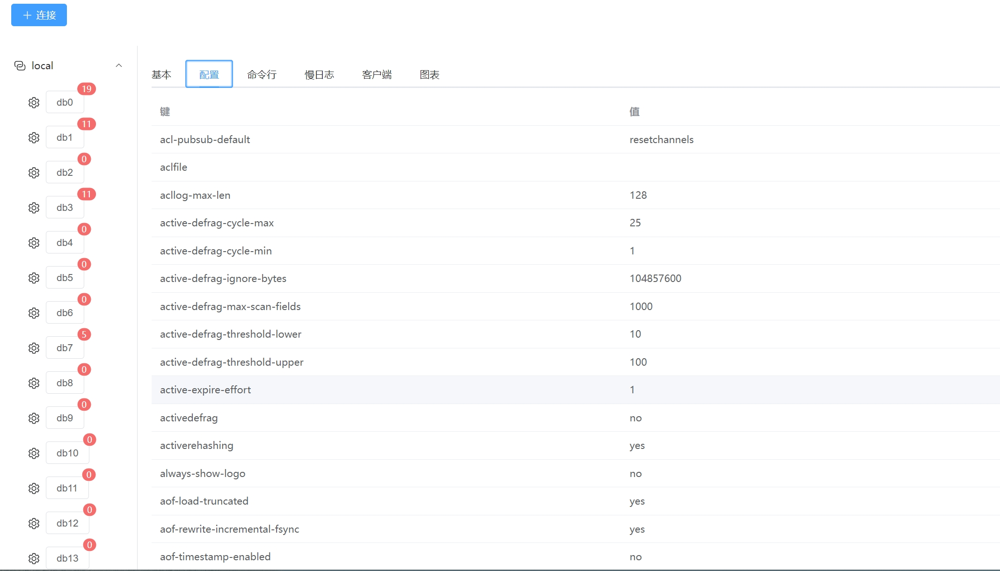
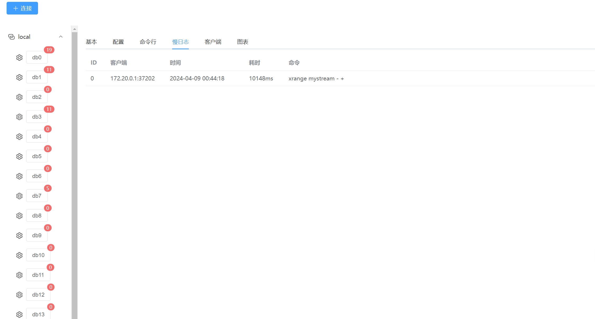
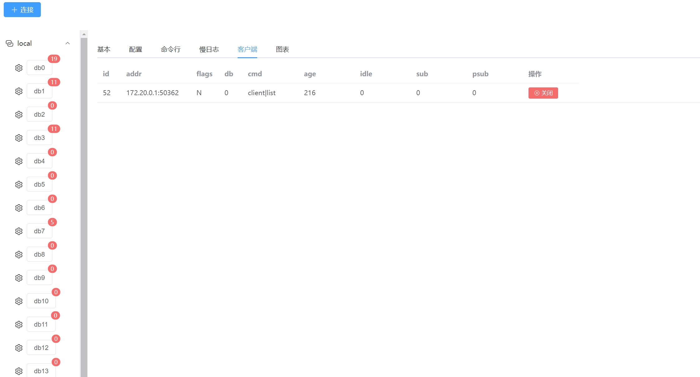
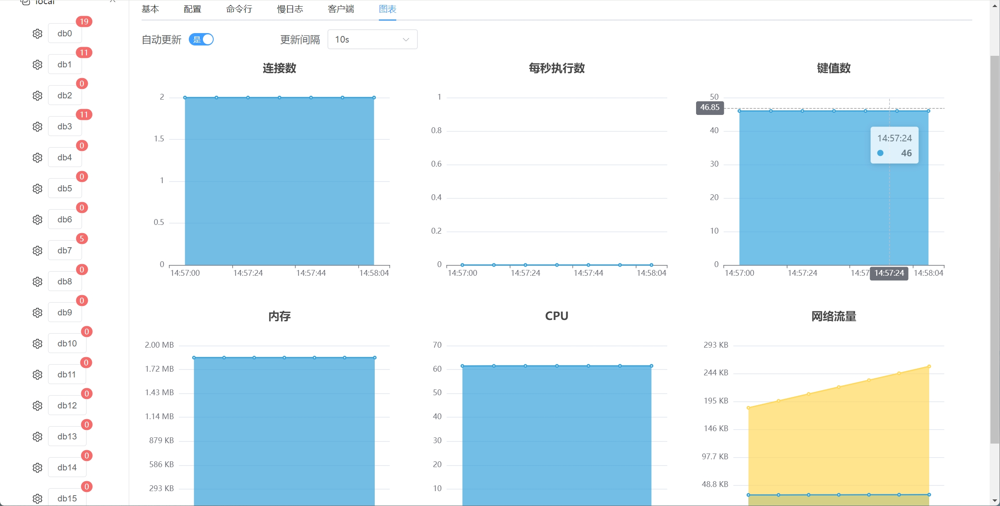
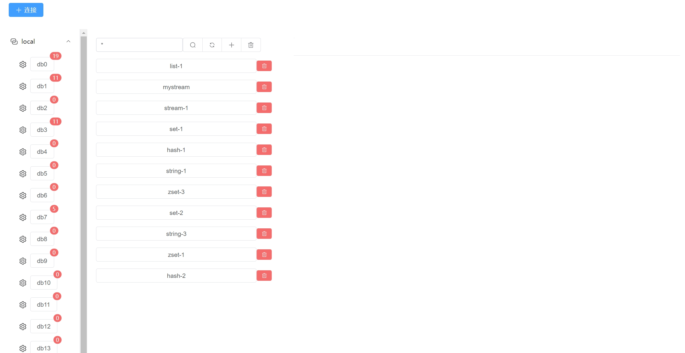
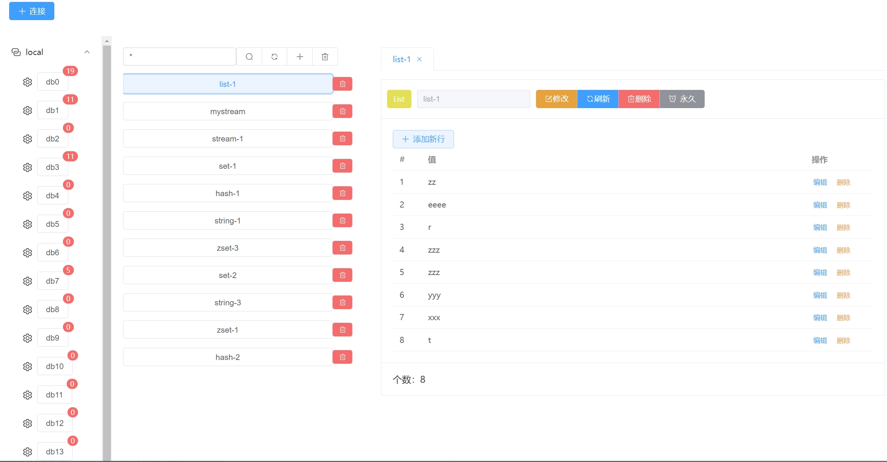

# rdm-toy

redis 可视化管理工具

## 功能

- redis 管理
- db 管理
- key 管理
- 支持命令行

## 🛠 技术栈

### 前端

- vue3
- vite
- pina
- element-plus

### 后端

- go
- redis
- gin

## 安装

### 前端

```bash
  cd frontend
  npm install
```

### 后端

```bash
  cd backend
  go mod tidy
```
    
## 本地运行

### 前端

```bash
  cd frontend
  npm run dev
```

### 后端

```bash
  cd backend
  go run cmd/root.go
```


## 截图












## 许可证

[MIT](https://choosealicense.com/licenses/mit/)

